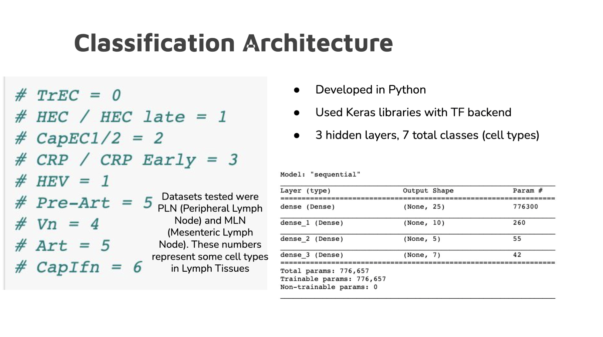
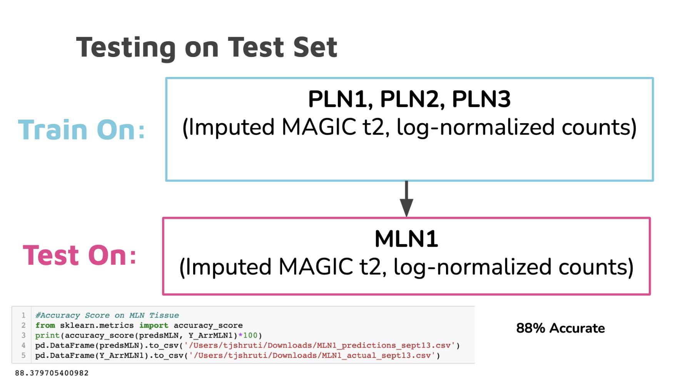
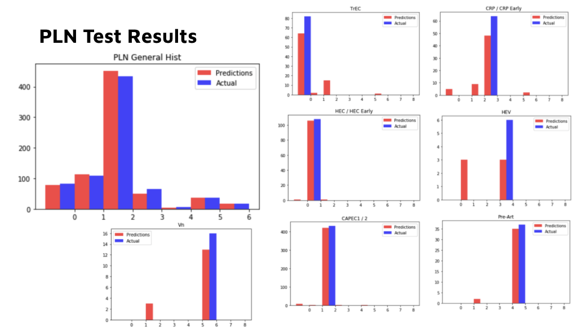
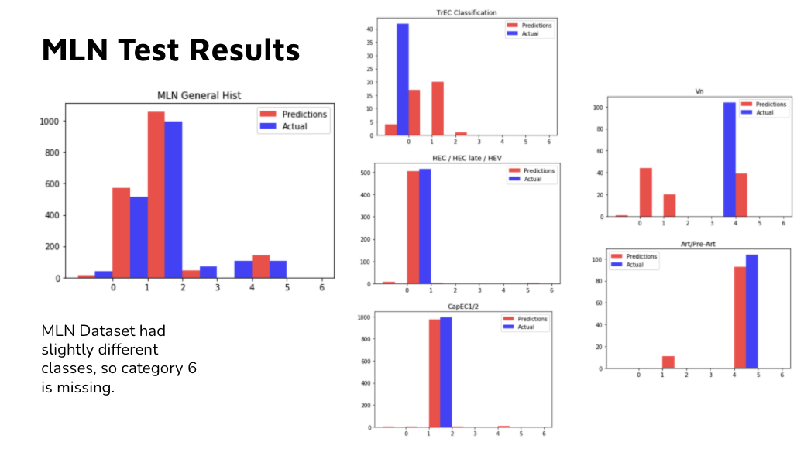

# Neural Net Endothelial Cell Classification

Below is an example of the classifcation results from a Nerual Net I developed on peripheral lymph node single-cell RNAseq data applied to both peripheral lymph node tissue (PLN) and mesenteric lymph node tissue (MLN). Classifcation across tissue type is usually difficult, but with proper overfitting adjustment, I was able to produce interesting results. 

I encourage the reader to check out the HTML version of the notebook in the above listing, as well as the PDF version of the presentation I gave summarizing this reaserch.

